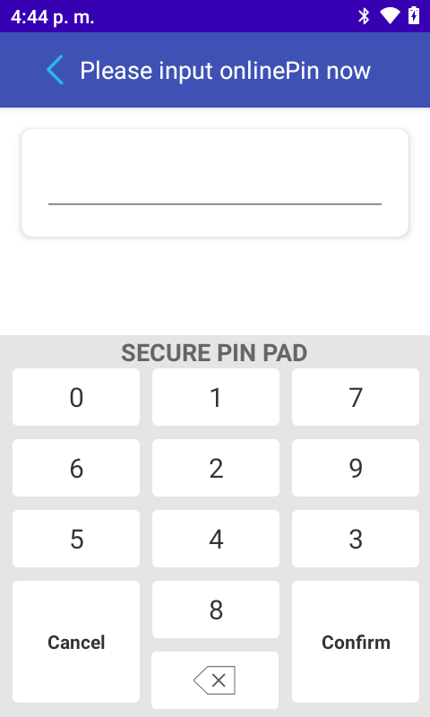

#### Effect picture

Please check our demo about draw the keyboard : [link](https://github.com/DspreadOrg/android/tree/master/pos_android_studio_demo/pos_android_app/src/main/java/com/dspread/pos/ui/payment/pinkeyboard)




#### Step:

1) Draw the pin keyboard on onQposRequestPinResult

2) Send the key coordinate postition on onQposRequestPinResult. The position should contains number(0-9) and function keys(confirm,cancel,delete) and their corresponding top left and bottom right coordinates in the screen.And it should be hexadecimal.

​	**The format for each key is :**

​	2 bytes keyvalue + 2 bytes x-coordinate of the upper left corner +  2 bytes y-coordinate of the upper left corner + 2 bytes x- coordinate of the lower right corner +  2 bytes y- coordinate of the lower right corner

For example：

> 0001002901ce00a40207000200b101ce012c02070003013a01ce01b5020700040029021300a4024c000500b10213012c024c0006013a021301b5024c00070029025800a40291000800b10258012c02910009013a025801b50291000000b1029d012c02d6000F013a029d01b50318000E0029029d00a40318000D00b102de012c0317

It is complete parameter of position value, let's introduce with "1":

> 0001 is keyvalue;
>
> 0029 is  x-coordinate of the upper left corner
>
> 01ce is  y-coordinate of the upper left corner
>
> 00a4 is  x- coordinate of the lower right corner
>
> 0207 is  y- coordinate of the lower right corner

​	**Here are the values for the function keys**

| KEY     | KEY VALUE |
| ------- | --------- |
| CANCEL  | 0D        |
| DELETE  | 0E        |
| CONFIRM | 0F        |

```java
		@Override
		public void onQposRequestPinResult(List<String> dataList, int offlinePinTimes) {
				...//draw the pin input keyboard,after finish the keyboard,then call the below api
				pos.pinMapSync(value,30);
            	//value is the keyboard pin coordinate position
				
		}
```

3)  Display or hide the keyboard  according to the number of pin input

After sending the pin keyboard coordinate position to the D20 device, then you can click the pin keyboard, and you can get the input pin count on the callback method onReturnGetPinInputResult

```java
		@Override
		public void onReturnGetPinInputResult(int num) {
				//the num is the counter of your pin input,if click "confirm" or "cancel",it will be -1 
				
		}
```

