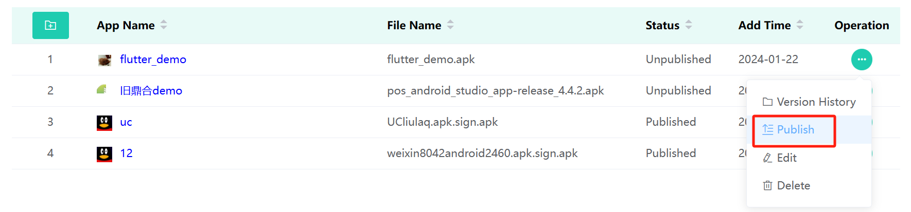

## 1. Login TMS SE

URL: https://www.dspreadser.net/#/login

*If you want to test the functionality of TMS, please contact us. We will provide you with a TMS account and password.*

## 2. Add Devices
If you want to push files to a device, you first need to register the device on TMS.  

### 2.1 Set Devices Model
Configure the model of the device you purchased.

### 2.2 Add Devices
There are two ways: 
1. Add a single device;
2. Import a batch of devices. download the import template and fill in the information according to the template format;

Fir**1. Add a single device**  
Please fill in the blanks as below(DSN, Model and System Version are mandatory), then click the button “OK”.  
> Note:   
> After adding the device, turn on the power to start TMS normally. If the device is already turned on, a reboot is required.  

**2. Import a batch of devices**  
Firstly, you need to download the "[Import Template](https://docs.google.com/spreadsheets/d/1qqHzk0OK0GWtzOoSS5DS2NAH0pKn2rhh/edit?usp=sharing&ouid=113176383357556413114&rtpof=true&sd=true)" and fill in the information according to the template format.  
Secondly, click the button and select the file of Import Templete.

## 3.Upload ROM/Firmware Files

As the first step to start pushing, you need to upload the file you want to push to the device to TMS. This part is about how to upload the files of firmware and ROM.

### 3.1 Add File
Click the OTA Upgrade Management menu on the left and click the Add button.  
Fill in the information as below(File, Type, Visual Range and Visual Object are mandatory).  
> Note: About the “Type” option.  
If the file is firmware(.asc file), select “Firmware”;  
If the file is ROM(.zip file), select “System”. 

### 3.2 Hit the shelves
After all of the file information has been confirmed, click the button “Publish” to put the file on the app store.  
  

You can see the status change from “Unpublished” to “Published”.  

## 4.Upload APP Files
Similar as the previous part, this part is about how to upload files of APP.

### 4.1 Upload APP
Click the Application menu on the left and click the Add button.
Fill in the information as below(APK, Icon, App Name, App Category are mandatory).  

  

### 4.2 Hit the shelves
After all of the file information has been confirmed, click the button “Publish” to put the app on the app store.  
  
You can see the status change from “Unpublished” to “Published”.  

### 4.3 App version upgrade
If your app have new version,please click this button for "Upgrade" as below.It is worth noting that you must change the version then can finish it or you will have to delete this and upload again.

## 5.File Push

This part is about how to push the files that already uploaded on TMS to the devices.

### 5.1 Add file
Click the “Push task” menu on the left and click the Add button.

### 5.2 Select file to push
> Note: “Message Type”  
If the file is firmware(.asc file), select “Firmware Update”;  
If the file is ROM(.zip file), select “Firmware Update”;  
If the file is APP(.apk file), select “App Install”.

### 5.3 Pop up
After clicking confirm button, the device will pop up a prompt about optional downloading the upgrade package.

### 5.4 Download
You can see the download progress from the drop-down menu bar, see as below.

## 6.Sub account correlation

This part mainly for describe how to open sub accounts and add devices.

### 6.1 Add sub account
Find Account information > Organization then click add button fill in the blank which marked by asterisk (*).
Pay attention that code can be same with account.

### 6.2 Distribution Devices
Find the corresponding subaccount,click "Devices" as below shown.

Click "Distribution Devices" button.

Next you can input the POSID then search it and click "add" button as below shown,this device will be added successfully.

### 6.3 Other supplement
For OTA package and appliction,uploading and pushing are same with primary account.Details can refer to part 4 and 5.