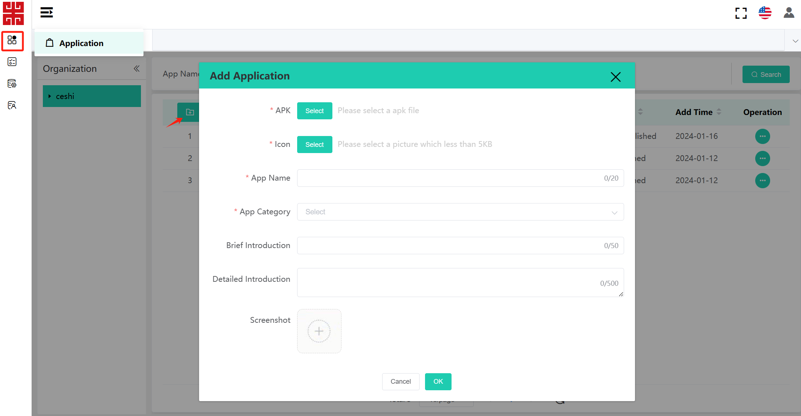

# **Android OS Update By TMS SE**

# 1. Login TMS SE System

URL: https://www.dspreadser.net/#/login  

*If you want to test the functionality of TMS, please contact us. We will provide you with a TMS account and password.*

 

# 2. Add Devices
If you want to push files to a device, you first need to register the device on TMS.  

There are two ways: 
1. Add a single device;
2. Import a batch of devices: download the import template and fill in the information according to the template format;

Please fill in the blanks as below(DSN, Model and System Version are mandatory), then click the button “OK”.  

> Note:   
> After adding the device, turn on the power to start TMS normally. If the device is already turned on, a reboot is required.  

 

# 3.Upload ROM/Firmware Files

As the first step to start pushing, you need to upload the file you want to push to the device to TMS. This part is about how to upload the files of firmware and ROM.

 

## 3.1 Add File
Click the OTA Upgrade Management menu on the left and click the Add button.  
Fill in the information as below(File, Type, Visual Range and Visual Object are mandatory).  
> Note: About the “Type” option.  
If the file is firmware(.asc file), select “Firmware”;  
If the file is ROM(.zip file), select “System”. 

## 3.2 Hit the shelves
After all of the file information has been confirmed, click the button “Back on” to put the file on the app store.  
  

You can see the status change from “Initial state(ROM)”/“Off the shelf(firmware)” to “On the shelf”.  

 

# 4.Upload APP Files
Similar as the previous part, this part is about how to upload files of APP.

 

## 4.1 Upload APP
Click the Application menu on the left and click the Add button.
Fill in the information as below(APK, Icon, App Name, Application classification, Visual Range and Visual Object are mandatory).  

  

## 4.2 Hit the shelves
After all of the file information has been confirmed, click the button “Back on” to put the app on the app store.  
  

You can see the status change from “Off the shelf” to “On the shelf”.  

 

# 5.File Push

This part is about how to push the files that already uploaded on TMS to the devices.

 

### 1.Click the “Push task” menu on the left and click the Add button.

 

### 2.Select file to push.
> Note: “Message Type”  
If the file is firmware(.asc file), select “Firmware Update”;  
If the file is ROM(.zip file), select “File Push”;  
If the file is APP(.apk file), select “App Install”.

 

### 3.After clicking confirm button, the device will pop up a prompt about force downloading the upgrade package.

 

### 4.You can see the download progress from the drop-down menu bar, see as below.

 
