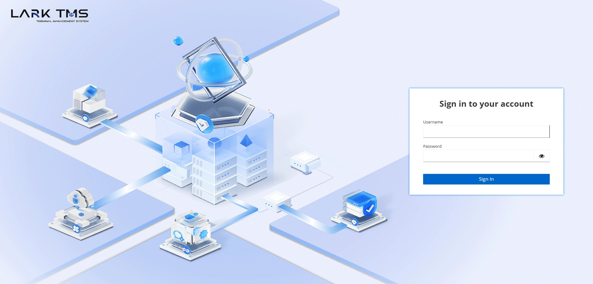
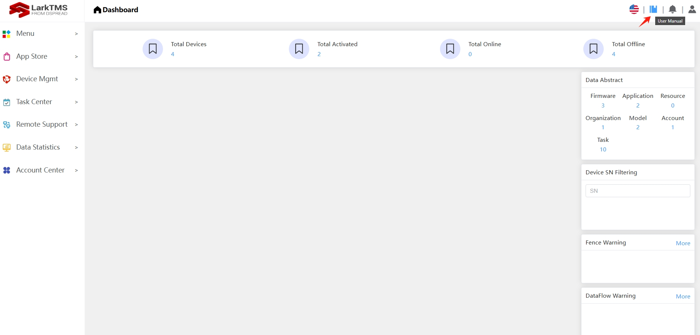

## Login and Manual

**1. Login Lark TMS**

URL: *https://www.dspreadser.net:9010*

If you want to test the functionality of TMS, please contact us. We will provide you with a TMS account and password.

**2. Manual**

If you want to check more information about Lark TMS, please check this [manual link](https://www.dspreadser.net:9010/userManual) or click the red arrow point icon in lark tms as below:

## Operation Videos
We have provided you with some push operation videos for your reference.

**1. Firmware Upgrade**
<iframe width="800" height="450" src="https://www.youtube.com/embed/r7JGBUdh9Qg?si=Zl4ZREZYOFEkTFvc"  frameborder="0" allow="accelerometer; autoplay; 
  clipboard-write; encrypted-media; gyroscope; picture-in-picture; web-share" referrerpolicy="strict-origin-when-cross-origin" allowfullscreen></iframe>

**2. APP Upgrade**
  
  **Install app by Lark TMS push**

<iframe width="800" height="450" src="https://www.youtube.com/embed/-k5w4iffE-Y?si=SgwZCPxwHo6iMjk6" frameborder="0" allow="accelerometer; autoplay; 
  clipboard-write; encrypted-media; gyroscope; picture-in-picture; web-share" referrerpolicy="strict-origin-when-cross-origin" allowfullscreen></iframe>
  
  **Install app by AppStore**

 <iframe width="800" height="450" src="https://www.youtube.com/embed/lMqeIO7xKBQ?si=y2qxxJwz2uoq3o1R" frameborder="0" allow="accelerometer; autoplay; 
   clipboard-write; encrypted-media; gyroscope; picture-in-picture; web-share" referrerpolicy="strict-origin-when-cross-origin" allowfullscreen></iframe>
