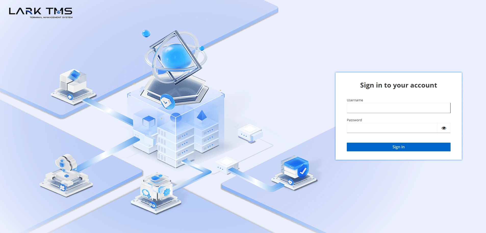
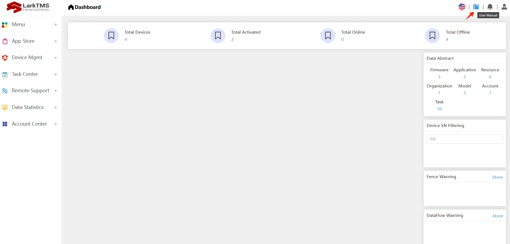

## 1. Login Lark TMS

URL: *https://www.dspreadser.net:9010*

If you want to test the functionality of TMS, please contact us. We will provide you with a TMS account and password.

## 2. Manual

If you want to check more information about Lark TMS, please check this manual link or click the red arrow point icon in lark tms as below:

*https://www.dspreadser.net:9010/userManual*

