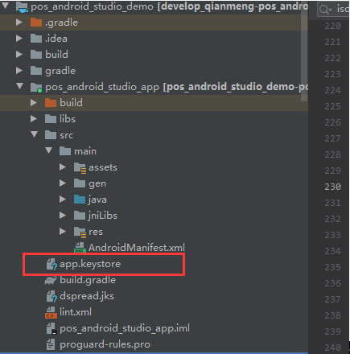
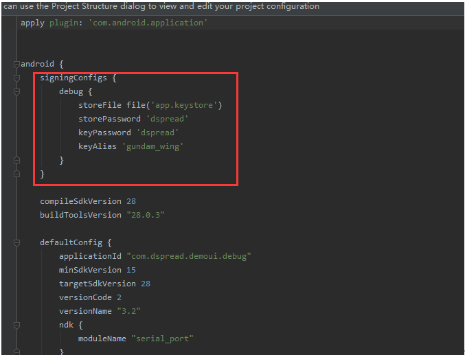
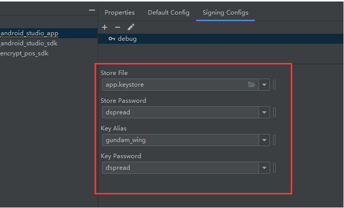
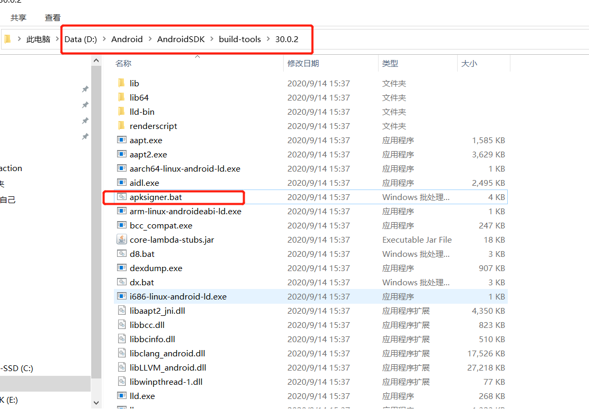
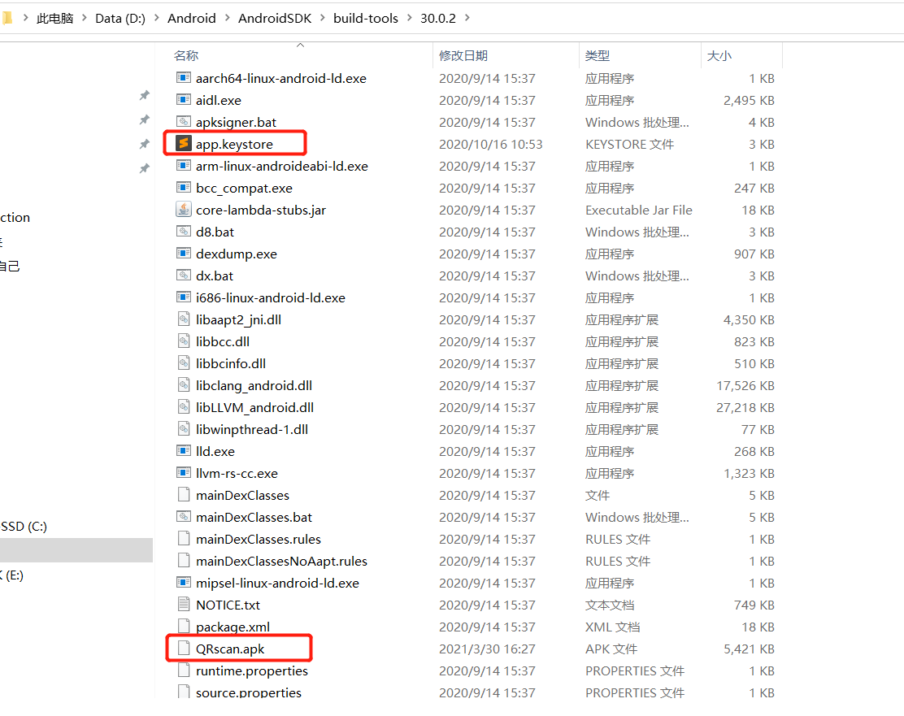
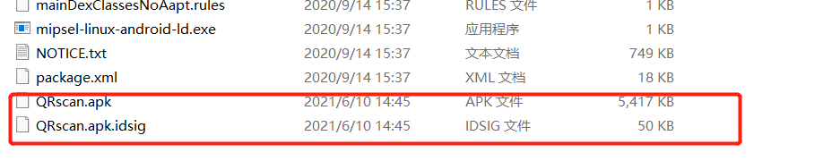

## Signing your App

1. Add the “app.keystore” file to your app project. ([The link ](https://github.com/DspreadOrg/android/blob/master/pos_android_studio_demo/pos_android_studio_app/app.keystore))

   

2. Add the debug sign code in your app “build.gradle” file

   

3. Open “File->project structure -> Modules”, to check the Signing Config

   

4. Install your app in D20 device.

## Sign the third-party App

1. Open your local Android SDK folder -> bulid-tools, select one version (in my instance, I choose 30.0.2); it has apksigner.bat in there. 

   

2. Put the app.keystore and the app you want to sign into this folder



3. Open cmd(windows)/Terminal(mac);  input

   ```
    apksigner sign --ks app.keystore QRscan.apk
   ```

    When you will see a new generated file (.idsig), it shows success. And the signed apk is the original name.



