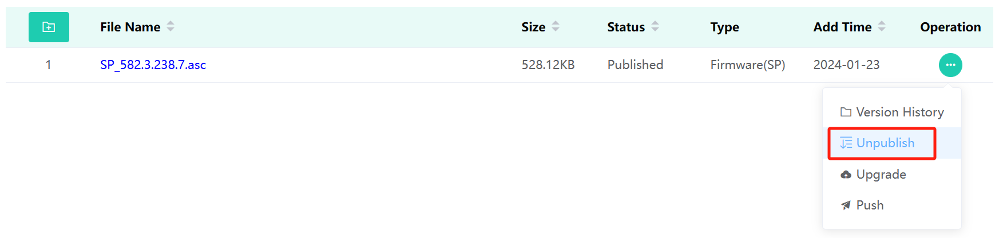
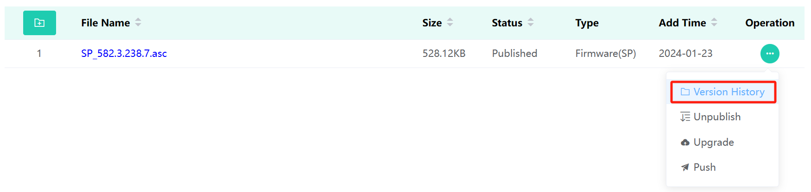
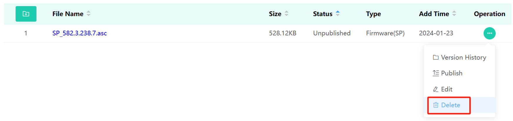

### 1.Check Device Information
After adding the device successfully, click the DSN to view the device information.  

### 2.Off the Shelves
Click the “Off the shelf” button to remove the file from the app store. After being removed from the shelves, the file information can be edited as mentioned above, or the file can be hit the shelf again.

### 2.Download
Click the button “History” and download the file, see as below.

### 3.Edit
Click the “Edit” option to change Visual Range and Visual Object.

### 4.Delete
Click the Delete Button to remove file.

### 5.Upgrade
If there is an update to the APP version, you can update the original version to the new version without adding the file on the main menu again. Click the button “Upgrade” and upload the new version of APP.  

The same situation can also be applied to firmware upgrades.

