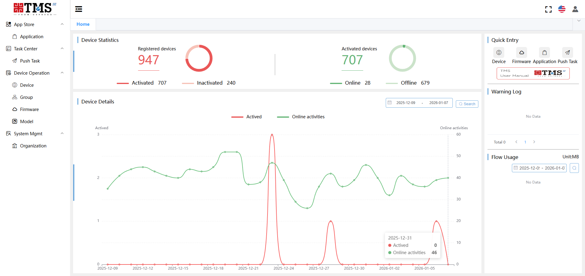

## Login and Manual

#### Login TMS SE

URL: https://www.dspreadser.net/#/login

*If you want to test the functionality of TMS, please contact us. We will provide you with a TMS account and password.*

#### 2. Manual

If you want to check more information about TMS SE, please donwload [TMS SE Manual](https://github.com/DspreadOrg/FAQs_Document/blob/master/documents/TMS%20SE%20Manual.pdf).

## Operation Videos

#### 1. Register Devices

<iframe width="800" height="450" src="./_video/registerDeviceVideo.html" frameborder="0"  scrolling="no" allowfullscreen></iframe>

#### 2. APP Upgrade

<iframe width="800" height="450" src="./_video/appUpdateVideo.html" frameborder="0"  scrolling="no" allowfullscreen></iframe>

#### 3. Firmware Upgrade

<iframe width="800" height="450" src="./_video/firmwareUpdateVideo.html" frameborder="0"  scrolling="no" allowfullscreen></iframe>

#### 4. ROM Upgrade

<iframe width="800" height="450" src="./_video/romUpdateVideo.html" frameborder="0"  scrolling="no" allowfullscreen></iframe>

