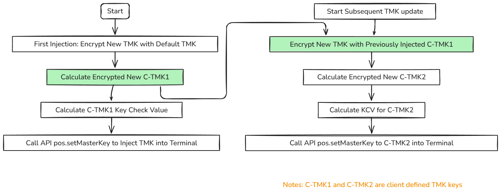

### Overview

According to PCI security, there is no keys allowed to be injected into device in plaintext. So every key that inject into device must be encrypted. QPOS support 2 different key management scheme: DUKPT and MKSK(Master/Session). Each key scheme working keys can be updated/injected under TMK or RSA key. The original TMK or RSA key are injected in dspread factory secure room by following procedures compliant with PCI PIN security.

### DUKPT

#### update IPEK key by TMK (symetrical)
By default, QPOS is injected TMK in factory. default tmk: **0123456789ABCDEFFEDCBA9876543210**. 

> server side should use same tmk as inside terminal to encrypt IPEK keys to get encryptedIPEK and calculate its Key Check Value, then call API pos.updateIPEKOperation() to inject into terminal
``` java
String demoTrackKsn ="09120200630001E0004C"
String demoTrackIpek="5AF93691729D99703E3F2E386B619DFC"
String demoIpekKcv = TDES.tdesECBEncrypt(demoTrackIpek, "0000000000000000"));
//encDemoTrackIpek = FF811AB9745399D6A5096AC1E6EE0AA7
//demoIpekKcv = 377EE0
String encDemoTrackIpek = TDES.tdesECBEncrypt(tmk, demoTrackIpek)); 
String demoEmvKsn ="09220200630001E0004C"
String demoEmvIpek="FA21E5290EE89881AF360574087496EA"
String demoEmvIpekKcv = TDES.tdesECBEncrypt(demoEmvIpek, "0000000000000000"));
//encDemoEmvIpek = 39A694D57E565D2BDB85447BF856F074
//demoIpekKcv = AE8F91
String encDemoEmvIpek = TDES.tdesECBEncrypt(tmk, demoEmvIpek)); 
String demoPinKsn ="09320200630001E0004C"
String demoPinIpek="0F3E0B885C29062A5C32263A06FB7533"
String demoPinIpekKcv = TDES.tdesECBEncrypt(demoPinIpek, "0000000000000000"));
//encDemoIpek = E1AAE4AB1550A8776CF693BE6EA9C9FB
//demoIpekKcv = 7DD75C
String encDemoPinIpek = TDES.tdesECBEncrypt(tmk, demoPinIpek)); 
//call api to inejct ipek, let keyIndex =0
/* pos.doUpdateIPEKOperation(0,   
        09120200630001E0004C,FF811AB9745399D6A5096AC1E6EE0AA7,377EE0,   
        09220200630001E0004C,39A694D57E565D2BDB85447BF856F074,AE8F91,   
        09320200630001E0004C,E1AAE4AB1550A8776CF693BE6EA9C9FB,7DD75C);*/
pos.doUpdateIPEKOperation(keyIndex,   
        demoTrackKsn,encDemoTrackIpek,demoIpekKcv,   
        demoEmvKsn,encDemoEmvIpek,demoEmvIpekKcv,   
        demoPinKsn,encDemoPinIpek,demoPinIpekKcv);
```

[Online Tool to 3des calculation demo](https://neapay.com/online-tools/des-calculator.html?data=FA21E5290EE89881AF360574087496EA&key=0123456789ABCDEFFEDCBA9876543210&algo=3DES&decr=false)


#### update IPEK key by RSA （Asymetrical）

Firstly,we need call API pos.generateTransportKey() to exchange the random key by RSA then using random key encrypt IPEK.Server side should use random key to encrypt IPEK keys to get encryptedIPEK and calculate its Key Check Value then call API pos.updateIPEKByTransportKey() to inject into terminal
``` java
pos.generateTransportKey(timeout);
// this parameter timeout which unit is second

public void onRequestGenerateTransportKey(Hashtable result) {
        try {
            InputStream priopen = getAssets().open("rsa_private_pkcs8_1024.pem");
            RSA rsa = new RSA();
            rsa.loadPrivateKey(priopen);
            byte[] bytes = rsa.decrypt(QPOSUtil.HexStringToByteArray((String) result.get("transportKey")));
        }catch (Exception e) {
            e.printStackTrace();
        }
 }
//get decryped random key

pos.updateIPEKByTransportKey(keyIndex,   
        demoTrackKsn,encDemoTrackIpek,demoIpekKcv,   
        demoEmvKsn,encDemoEmvIpek,demoEmvIpekKcv,   
        demoPinKsn,encDemoPinIpek,demoPinIpekKcv);
```

#### update IPEK key by TR-31
For above parameters,KeyIndex represent key group;<br />keyType include NEW_KEY_ALL,NEW_KEY_TMK,NEW_KEY_PIN,NEW_KEY_DATA;<br />keyBlock is TR31 data block(support A and D version) which generated by HSM.
```java
pos.updateKeyByTR_31(int keyIndex,TR31keyType keyType,String keyBlock,int timeout);
```
### MK/SK

#### update session key
By default, QPOS is injected TMK in factory. default TMK: **0123456789ABCDEFFEDCBA9876543210**. 

?>server side should use same TMK as inside terminal to encrypt session keys to get encrypted session keys and calculate its Key Check Value, then call API pos.updateWorkKey() to inject into terminal
``` java
String demoPINKey="11111111111111111111111111111111"
String encDemoPINKey = TDES.tdesECBEncrypt(tmk, demoPINKey)); 
//encDemoPINKey = 9B3A7B883A100F739B3A7B883A100F73
String demoPINKeyKcv = TDES.tdesECBEncrypt(demoPINKey, "0000000000000000")); 

String demoTRACKKey="11111111111111111111111111111111"
String encDemoTRACKKey = TDES.tdesECBEncrypt(tmk, demoTRACKKey)); 
//encDemoTRACKKey = 9B3A7B883A100F739B3A7B883A100F73
String demoTRACKKeyKcv = TDES.tdesECBEncrypt(demoTRACKKey, "0000000000000000")); 

String demoMACKey="11111111111111111111111111111111"
String encDemoMACKey = TDES.tdesECBEncrypt(tmk, demoMACKey)); 
//encDemoMACKey = 9B3A7B883A100F739B3A7B883A100F73
String demoMACKeyKcv = TDES.tdesECBEncrypt(demoMACKey, "0000000000000000")); 

//call api to inject session keys, let keyIndex =0
pos.udpateWorkKey(
                    encDemoPINKey, demoPINKeyKcv,//PIN KEY
                    encDemoTRACKKey, demoTRACKKeyKcv,  //TRACK KEY
                    encDemoMACKey, demoMACKeyKcv, //MAC KEY
                    keyIndex);

```

[Online Tool to 3des calculation demo](https://neapay.com/online-tools/des-calculator.html?data=11111111111111111111111111111111&key=0123456789ABCDEFFEDCBA9876543210&algo=3DES&decr=false)


#### update master key

By default, QPOS is injected TMK in factory. default TMK: **0123456789ABCDEFFEDCBA9876543210**. 

?>server side should use default TMK to encrypt new TMK to get encrypted new TMK key and calculate its Key Check Value, then call API pos.updateMasterKey() to inject into terminal
``` java
String demoNewMasterKey="22222222222222222222222222222222"
String encDemoNewMasterKey = TDES.tdesECBEncrypt(tmk, demoNewMasterKey)); 

//encDemoNewMasterKey = B4ABA2BB791C50E7B4ABA2BB791C50E7
String demoNewMasterKeyKcv = TDES.tdesECBEncrypt(demoNewMasterKey, "0000000000000000")); 

//call api to inject new master key, let keyIndex =0
pos.setMasterKey(encDemoNewMasterKey, demoNewMasterKeyKcv, //new master key
                    keyIndex);

```

[Online Tool to 3des calculation demo](https://neapay.com/online-tools/des-calculator.html?data=22222222222222222222222222222222&key=0123456789ABCDEFFEDCBA9876543210&algo=3DES&decr=false)


