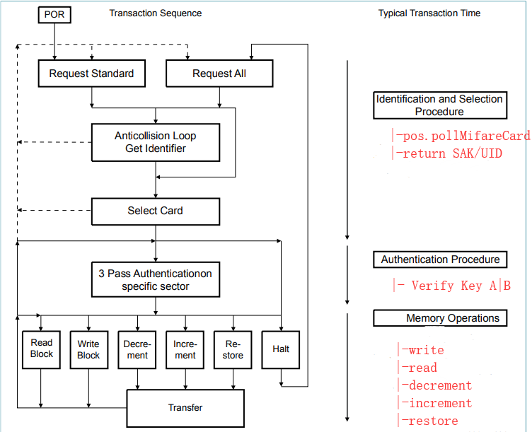

## mifare classic
**Mifare Classic**



As the above image, we can know the work flow for the Mifare Classic.
1).poll on Card
```java
	pos.pollOnMifareCard(int timeout)
```
2).Verify Key A/B
```java
	pos.authenticateMifareCard(MifareCardType cardType,String keyType,String block,String keyValue,int timeout)
```
3).Operate Card
    - Add/Reduce/Restore
```java
	pos.operateMifareCardData(MifareCardOperationType type,String block,String data,int timeout)
```
    - Read
```java
	pos.readMifareCard(MifareCardType cardType,String block,int timeout)
```
    - Write
```java
	pos.writeMifareCard(MifareCardType cardType,String block,String data,int timeout)
```
4).Finish
```java
	pos.finishMifareCard(int timeout)
```

