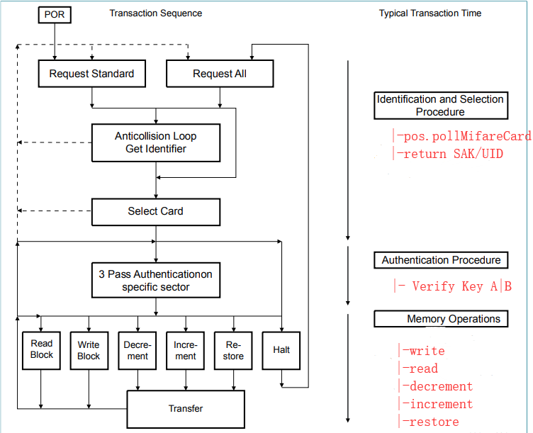

## mifare classic
**Mifare Classic**



As the above image, we can know the work flow for the Mifare Classic.
1).poll on Card
```java
	pos.activateMifareCard(int timeout)
//callback
    onActivateMifareCardResult(Hashtable<String, String> arg0)
```
2).Verify Key A/B
```java
	pos.authenticateMifareCard(MifareCardType cardType,String keyType,String block,String keyValue,int timeout)
//callback
    onAuthenticateMifareCardResult(boolean arg0)
```
3).Operate Card
- Add
```java
	pos.increaseValue(String block,String data,int timeout)
//callback
    onIncreaseValueResult(boolean result)
```
- Reduce
```java
	pos.decreaseValue(String block,String data,int timeout)
//callback
    onDecreaseValueResult(boolean result)
```
- Read
```java
	pos.readMifareBlock(MifareCardType cardType,String block,int timeout)
//callback
    onReadMifareBlockResult(String flag)
```
- Write
```java
	pos.writeMifareBlock(MifareCardType cardType,String block,String data,int timeout)
//callback
    onWriteMifareBlockResult(boolean arg0)
```
4).Finish

```java
	pos.deactivateMifareCard(int timeout)
//callback
    onDeactivateMifareCardResult(boolean arg0)
```

